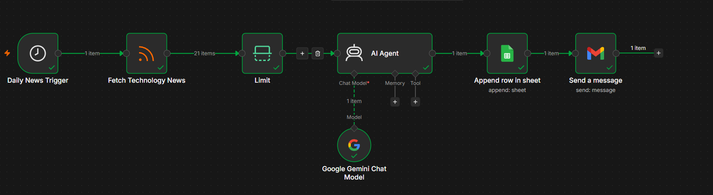
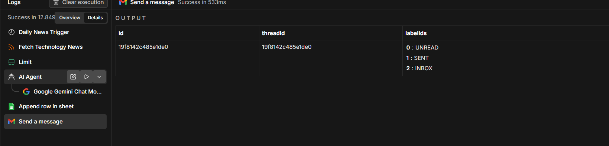
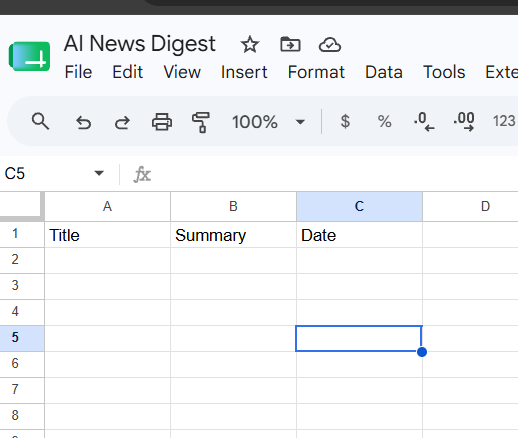
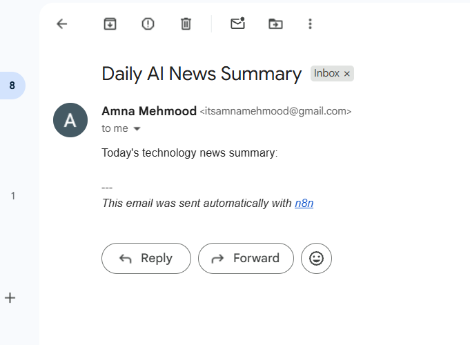

# AI-Powered Technology News Automation using n8n

An end-to-end AI automation workflow that automatically collects technology news, generates intelligent summaries using Google Gemini AI, stores processed information in Google Sheets, and delivers updates through Gmail.

This project demonstrates the integration of artificial intelligence, workflow automation, and cloud services to build an automated information processing pipeline.

---

## Project Overview

Staying updated with technology trends requires continuously searching news sources, reading lengthy articles, extracting key information, and organizing insights manually.

This project automates the complete workflow by creating an AI-powered technology news assistant that:

- Retrieves technology news automatically from an RSS feed.
- Processes and summarizes articles using Google Gemini AI.
- Stores structured summaries in Google Sheets.
- Sends automated email notifications through Gmail.

The workflow reduces manual effort and demonstrates how AI can be integrated with automation platforms to solve real-world productivity problems.

---

## Problem Statement

Technology professionals and students need access to relevant and updated information, but manually collecting and summarizing news requires significant time.

This automation addresses this problem by providing:

- Automated news collection.
- AI-based content summarization.
- Structured information storage.
- Automated email delivery of important insights.

---

## System Architecture

The automation pipeline follows this workflow:

```
Schedule Trigger
        |
        v
RSS Feed Reader
        |
        v
AI Agent + Google Gemini Model
        |
        v
Google Sheets
        |
        v
Gmail Notification
```

---

## Technologies Used

| Technology | Purpose |
|------------|---------|
| n8n | Workflow automation platform |
| Google Gemini AI | AI-powered article summarization |
| RSS Feed | Technology news data source |
| Google Sheets API | Structured data storage |
| Gmail API | Automated email delivery |
| OAuth 2.0 | Secure authentication |

---

## Workflow Components

### 1. Schedule Trigger

The workflow begins with the n8n Schedule Trigger node.

Responsibilities:

- Automatically starts workflow execution.
- Enables scheduled news processing.
- Removes the need for manual execution.

---

### 2. RSS Feed Reader

The RSS node retrieves the latest technology news articles.

Extracted information includes:

- Article title
- Article content
- Publication date
- Article URL

This data is passed to the AI processing stage.

---

### 3. AI Agent with Google Gemini

The AI Agent processes the retrieved article content using the Google Gemini language model.

AI Prompt:

```
Summarize this news article in 5 bullet points.
Explain why this news is important.

Article:
{{$json.content}}
```

The AI system:

- Understands article context.
- Extracts important information.
- Generates concise summaries.
- Explains the importance of each article.

---

### 4. Google Sheets Integration

The generated summaries are automatically stored in Google Sheets.

Stored information:

| Field | Description |
|------|-------------|
| Title | News article title |
| Summary | AI-generated summary |
| Date | Processing timestamp |

This creates a structured database of processed technology news.

---

### 5. Gmail Integration

The Gmail node sends the generated AI summary through email.

Purpose:

- Provides automated notifications.
- Delivers personalized technology updates.
- Completes the end-to-end automation pipeline.

---

# Project Screenshots

## Workflow Canvas



---

## Successful Execution



---

## Google Sheets Output



---

## Gmail Notification



---

## Repository Structure

```
AI-News-Automation-n8n
|
├── README.md
├── workflow.json
├── workflow.png
├── execution.png
├── google-sheet.png
└── gmail.png
```

---

## Workflow Results

The automation successfully:

- Retrieved technology news articles.
- Generated AI-powered summaries.
- Stored processed information in Google Sheets.
- Delivered automated email notifications.

---

## Skills Demonstrated

This project demonstrates practical experience with:

- Workflow automation using n8n.
- AI model integration.
- API authentication and cloud services.
- Data processing pipelines.
- No-code automation systems.
- AI-powered productivity solutions.

---

## Future Improvements

Potential enhancements:

- Integrate multiple technology news sources.
- Add AI-based news categorization.
- Generate automated weekly reports.
- Create analytics dashboards.
- Add Telegram or Discord notifications.
- Store historical data in SQL databases.
- Develop a web dashboard for personalized news tracking.

---

## Author

Amna Mahmood

BS Computer Science Student  
Data Science and Machine Learning Enthusiast

Areas of Interest:

- Artificial Intelligence
- Machine Learning
- Data Science
- Automation Systems

---

## License

This project is licensed under the MIT License.

---

## Acknowledgements

- n8n for workflow automation capabilities.
- Google Gemini AI for intelligent text processing.
- Google APIs for cloud integrations.
